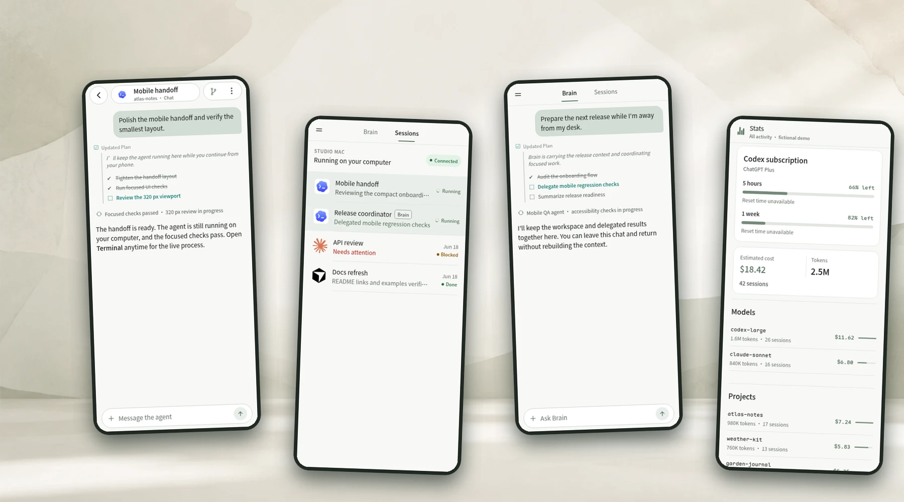
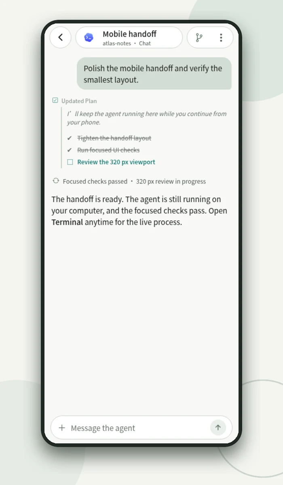
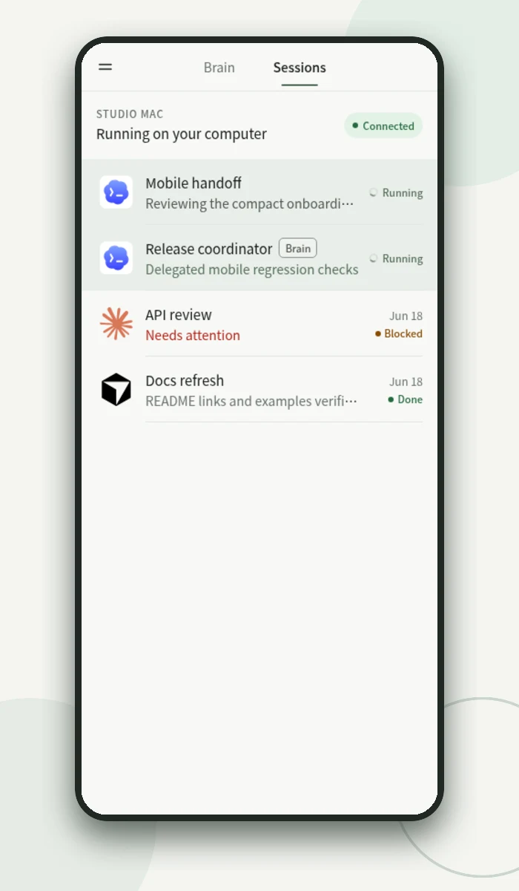
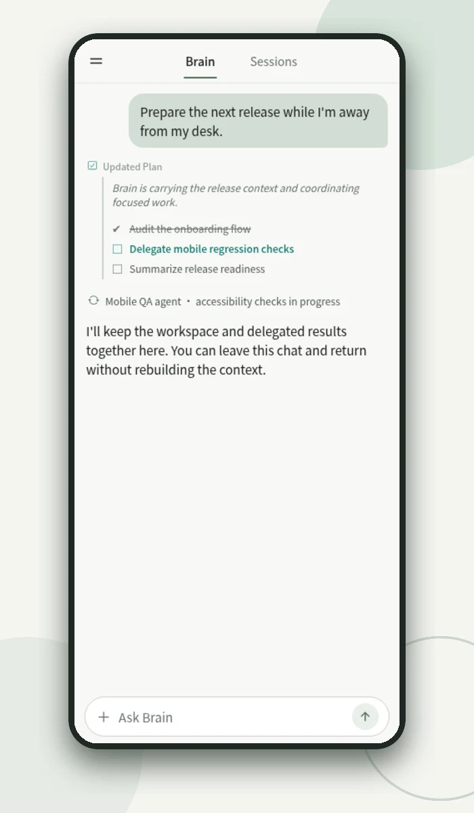
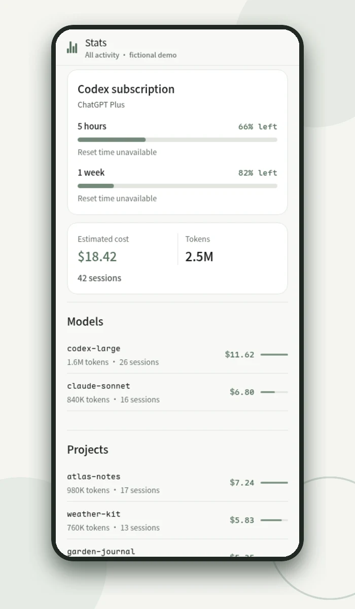

<p align="center">
  
</p>

<h1 align="center">Zen</h1>

<h3 align="center">Your coding agents, wherever you are.</h3>

<p align="center">
  Zen keeps coding agents running on your own computer and gives you Chat, live Terminal,
  Sessions, and persistent Brain on your phone. Your code and credentials stay on your machine.
</p>

<p align="center">
  <a href="https://github.com/daoleno/zen/releases"></a>
  <a href="https://github.com/daoleno/zen/actions/workflows/release-artifacts.yml"></a>
  <a href="https://testflight.apple.com/join/rTKCDzMt"></a>
  <a href="LICENSE"></a>
</p>

<p align="center">
  
</p>

## What you can do

- **Continue in Chat** — follow structured agent messages, tool calls, plans, and progress.
- **Take over in Terminal** — open the live tmux session when you need the raw interface.
- **Manage Sessions** — see what is running, finished, or waiting for input across projects.
- **Keep work moving in Brain** — preserve useful context, organize ongoing work, and pick it up later.

<table>
  <tr>
    <td width="50%"></td>
    <td width="50%"></td>
  </tr>
  <tr>
    <td align="center"><strong>Structured Chat</strong><br>Stay with the agent without losing its working context.</td>
    <td align="center"><strong>Sessions</strong><br>See active, completed, and attention-needed work at a glance.</td>
  </tr>
  <tr>
    <td width="50%"></td>
    <td width="50%"></td>
  </tr>
  <tr>
    <td align="center"><strong>Brain</strong><br>Stay oriented across chats while Brain plans and advances ongoing work.</td>
    <td align="center"><strong>Stats</strong><br>Understand agent activity and usage from your own daemon.</td>
  </tr>
</table>

## Brain keeps work moving

Brain remembers useful context and your preferences. It keeps the active objective, decisions, open threads, and next step together, breaks work into manageable steps, and moves it forward over time.

When action is needed, Brain uses tools or hands focused work to an agent session, reusing that session when helpful. It reviews the results before deciding what comes next. Its workspace persists across chats, devices, and restarts, so you can leave and pick up where you left off.

## Quick start

Install the daemon from [GitHub Releases](https://github.com/daoleno/zen/releases), then on the computer that has `tmux` and an authenticated coding-agent CLI:

```bash
zen doctor
zen --lan
```

Zen prints a `zen pair` command for each detected private address. Keep the daemon running, open another terminal, and run the command for the same trusted network as your phone:

```bash
zen pair http://192.168.1.42:9876
```

Use the address Zen prints—not the example above. Open the mobile app and **scan or import the pairing code**.

For installation details, iOS source builds, or remote HTTPS access, see [Install the daemon](docs/install-daemon.md) and [Connect and pair](docs/connect-and-pair.md).

## How it works

The Zen daemon runs beside your repositories, authenticated agent CLIs, and tmux sessions on your Linux computer or Apple Silicon Mac. Connect the Android or iOS app over the same trusted private network, or provide an HTTPS endpoint for access away from home. You choose and control that network path; Zen then handles one-time enrollment and signed device requests.

Read [Security and privacy](docs/security-and-privacy.md) for the trust model and [Architecture](docs/architecture.md) for protocol details.

## Platform availability

| Component | Availability |
| --- | --- |
| Daemon | Release binaries for Linux `amd64`/`arm64` and Apple Silicon macOS |
| Android | `arm64-v8a` APK from GitHub Releases |
| iOS | [TestFlight Preview](https://testflight.apple.com/join/rTKCDzMt) public invitation configured; Beta App Review pending. Source builds remain available for arm64 devices and Apple Silicon Simulator |

The TestFlight Preview uses a public invitation link, but Apple must approve the beta before new testers can install it. See the [Android](docs/android.md) and [iOS](docs/ios.md#testflight-preview-access) guides for current installation, access, and validation details.

## Learn more

Start with the [documentation guide](docs/README.md). Contributions are welcome—see [CONTRIBUTING.md](CONTRIBUTING.md).

Zen is licensed under the [Apache License 2.0](LICENSE). Attribution and brand guidance are in [NOTICE](NOTICE) and [TRADEMARKS.md](TRADEMARKS.md).
